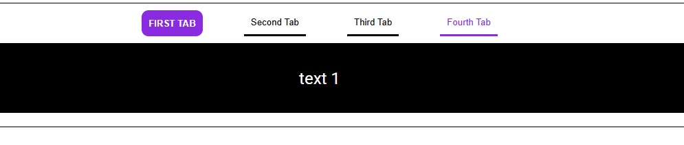

  <h1 align="center">
    TABS - JS
  </h1>

 

# Objective
create a simple tabs functionality using HTML, CSS, and basic JavaScript. The page will have four tabs, with the first tab being active by default. When the user clicks on another tab, the content of the current tab will be hidden, and the content of the selected tab will be displayed.
 
 

# README
https://roadmap.sh/projects/simple-tabs
 
 

# PREVIEW

